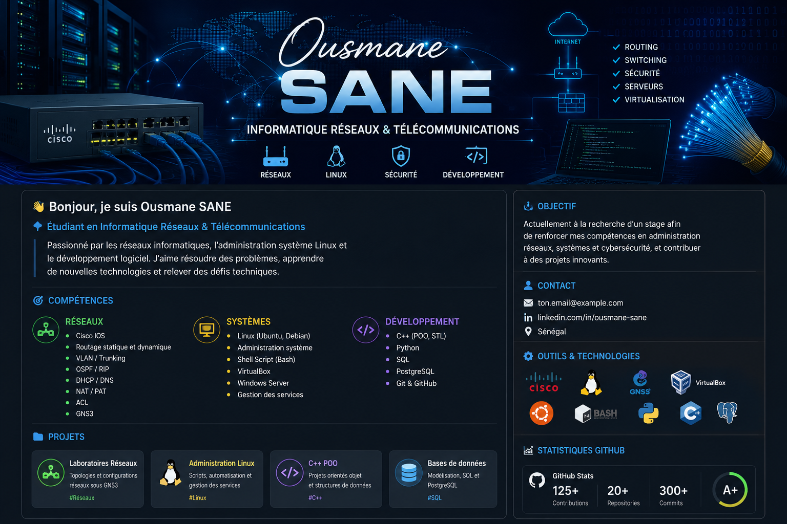

  

<h1 align="center">👋 Bonjour, je suis Ousmane SANE</h1>

<h3 align="center">Étudiant en Informatique Réseaux & Télécommunications</h3>

Passionné par les réseaux informatiques, Linux, la cybersécurité et le développement logiciel.

---

## 🚀 À propos de moi

🎓 Étudiant en Informatique Réseaux et Télécommunications

🔭 Actuellement en formation sur :
- Cisco Networking
- Linux Administration
- Virtualisation
- C++
- PostgreSQL

🌱 Objectif :
Développer mes compétences en administration réseaux, systèmes et cybersécurité.

---

## 🛠️ Compétences Techniques

### 🌐 Réseaux

- Cisco IOS
- Routage Statique
- OSPF
- RIP
- VLAN
- Trunking
- NAT / PAT
- ACL
- DHCP
- DNS
- GNS3

### 🐧 Systèmes

- Linux (Ubuntu / Debian)
- Bash
- VirtualBox
- Windows Server
- Gestion des utilisateurs
- Gestion des services

### 💻 Développement

- C++
- Python
- SQL
- PostgreSQL
- Git
- GitHub

---

## 🔧 Outils

---

## 📂 Projets

### 🌐 Laboratoires Réseaux

- VLAN et Trunking
- OSPF Multi-Area
- Routage Statique
- DHCP
- NAT
- ACL

### 🐧 Linux

- Scripts Bash
- Gestion des utilisateurs
- Sauvegardes automatiques
- Administration système

### 💻 C++

- Programmation Orientée Objet
- Classes et Objets
- Héritage
- Polymorphisme
- Templates

### 🗄️ Bases de données

- PostgreSQL
- Modélisation relationnelle
- Requêtes SQL

---

## 📊 Statistiques GitHub

---

## 🎯 Objectif Professionnel

Je suis actuellement à la recherche d'un stage dans les domaines :

- Administration Réseaux
- Administration Systèmes Linux
- Télécommunications
- Cybersécurité
- Support Informatique

---

## 📫 Contact

📍 Sénégal

📧 sane.ousmane3@ugb.edu.sn

🔗 LinkedIn : à compléter

---

⭐ N'hésitez pas à consulter mes projets et laboratoires réseaux.
